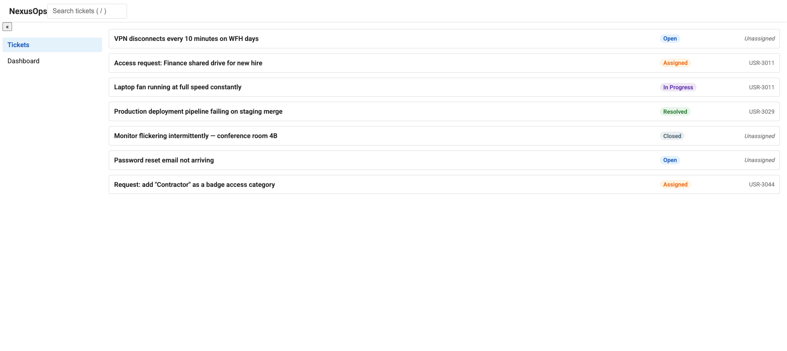

# NexusOps

Enterprise operations platform built with modern Angular (Signals,
zoneless change detection, hybrid rendering). Built in public as
an architecture deep-dive.

## Status

🚧 Shell, navigation, and ticket list feature are live. Ticket detail and creation flows are in progress.

## Architecture so far

- Standalone components throughout, bootstrapped via `bootstrapApplication`
- Application shell (header, sidebar, content) with lazy-loaded feature routes
- Ticket list feature backed by the domain model, rendered via a reusable `TicketCard`
- Fully responsive (mobile-first, 768px breakpoint)
- Design token system (CSS custom properties) for color, spacing, typography, and elevation
- Self-hosted Roboto typeface

## Planned architecture

Auth + RBAC · Admin portal · Real-time dashboards · Dynamic forms ·
SSR/hybrid rendering · AI copilot · Full test coverage · Docker + CI/CD

## Stack

Angular 20+ · TypeScript (strict) · ESLint · Prettier

## Setup

npm install && npm start

## Conventions

- Conventional Commits
- Trunk-based branching, PRs into `main`
