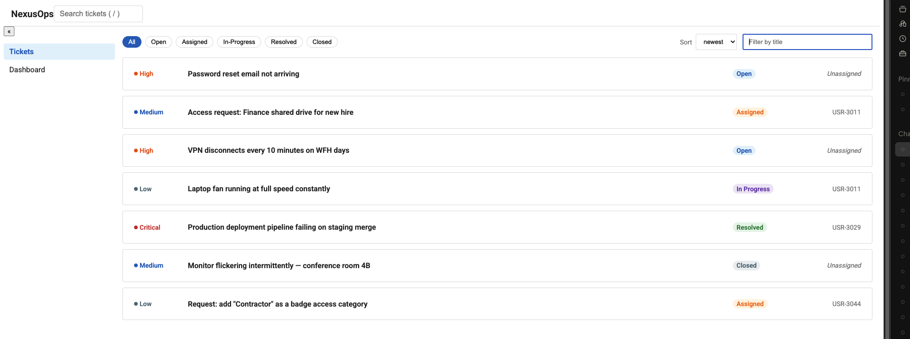
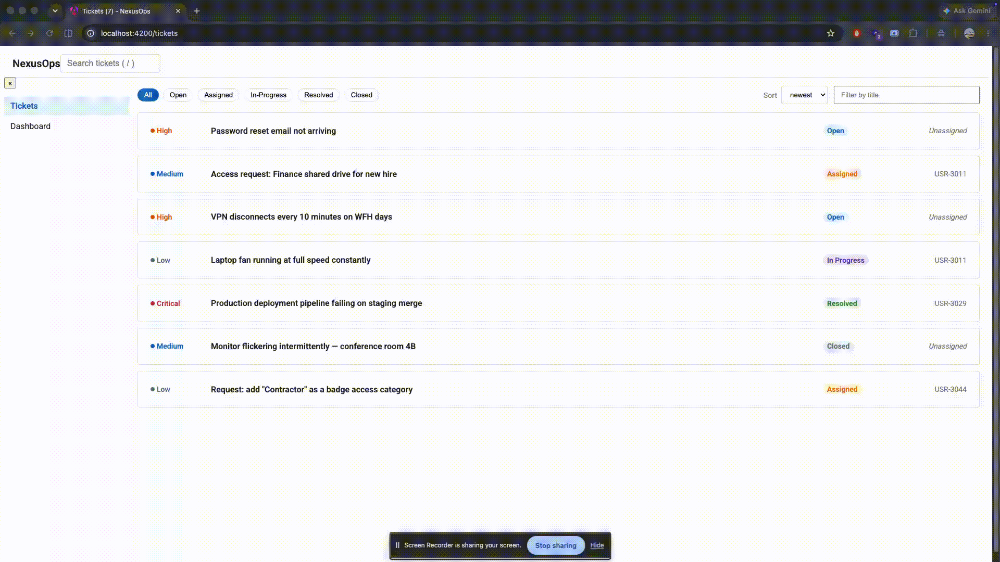

# NexusOps

Enterprise operations platform built with modern Angular (Signals,
zoneless change detection, hybrid rendering). Built in public as
an architecture deep-dive.




## Status

🚧 Shell, navigation, ticket list, dashboard, and ticket detail are live, all backed by a signal-based state layer. Data fetching from a real backend and auth are in progress.

## Architecture so far

- Standalone components throughout, bootstrapped via `bootstrapApplication`
- Application shell (header, sidebar, content) with lazy-loaded feature routes
- Signal-based `TicketStore`: private writable state, read-only queries, and named commands — no component owns ticket data directly
- Ticket list, dashboard, and ticket detail (`/tickets/:id`, via signal-input route params) all read from the same store
- Filtering, text search, and sorting composed from signals into derived (`computed`) view state
- Fully responsive (mobile-first, 768px breakpoint)
- Design token system (CSS custom properties) for color, spacing, typography, and elevation
- Self-hosted Roboto typeface

<pre>```shell (header + sidebar)
   │
   └── lazy feature routes
          │
          ├── /tickets        ─┐
          ├── /tickets/:id    ─┤ read signals, call commands
          └── /dashboard      ─┘
                                 │
                                 ▼
                          TicketStore
                    (private state · public
                     queries · named commands)
                                 │
                                 ▼
                          domain types
                    (branded ids, discriminated
                       unions, exhaustiveness)
```</pre>

## State management

- Signal-based stores, no external state library — served entirely by Angular's own primitives
- Command–query shape: private writable signals, read-only queries (`asReadonly()` / `computed`), state changes only through named commands
- Nothing is duplicated: any value calculable from existing state (counts, the filtered/sorted list) is a `computed`, never a second stored copy
- `linkedSignal` for state that's user-writable but resets on an upstream change — e.g. sort order resetting when the status filter changes
- `effect()` reserved for side effects leaving the reactive world (persisting UI state, updating the document title) — never for deriving state

## Planned architecture

Auth + RBAC · Admin portal · Live backend for dashboards (currently derived from local state) ·
Dynamic forms · SSR/hybrid rendering · AI copilot · Full test coverage · Docker + CI/CD

## Stack

Angular 20+ · TypeScript (strict) · ESLint · Prettier

## Setup

npm install && npm start

## Conventions

- Conventional Commits
- Trunk-based branching, PRs into `main`
